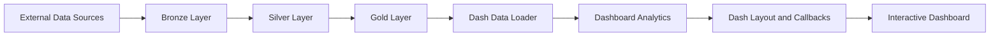
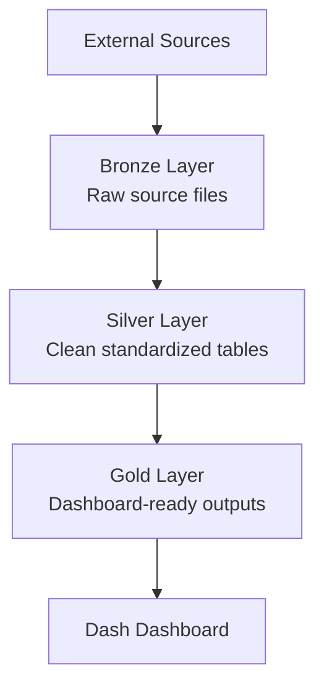
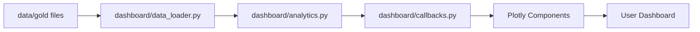
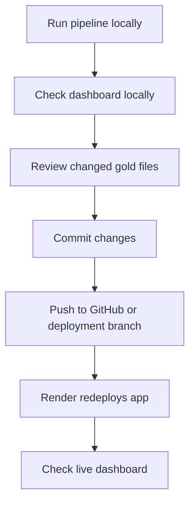

# European EV Transition Monitor - Technical Guide

## 1. Overview

The European EV Transition Monitor is an interactive dashboard built with Python, Dash, Plotly, and Pandas.

The purpose of the dashboard is to show how the European passenger-car market is moving from traditional internal combustion engine vehicles to electric and hybrid vehicles.

In simple words, the dashboard answers questions such as:

- How many new passenger cars were registered in Europe each year?
- What share of the market is BEV, PHEV, HEV, petrol, or diesel?
- Which countries are leading or lagging in electrified vehicle adoption?
- How has the powertrain mix changed over time?
- What is the estimated market value of new vehicle registrations?
- What does the BEV and PHEV outlook look like compared with IEA projection data?

The dashboard is not only a visual interface. It also includes a full data pipeline that downloads, cleans, combines, and prepares the data before the dashboard reads it.

Current project state:

| Item | Description |
|---|---|
| Project type | Interactive data dashboard |
| Main topic | European EV transition and passenger-car registrations |
| Application framework | Dash |
| Charting library | Plotly |
| Data processing | Pandas |
| Dependency manager | `uv` with `pyproject.toml` and `uv.lock` |
| Main app file | `dashboard/app.py` |
| Main pipeline file | `scripts/run_pipeline.py` |
| Hosted deployment config | `render.yaml` |
| Current dashboard data layer | `data/gold/` |

## 2. What Exactly Is Being Done?

The project does four main things.

### 2.1 It collects data from external sources

The pipeline fetches data from:

- Eurostat
- Our World in Data
- IEA Global EV Data Explorer
- ACEA

Each source is used for a different reason. Eurostat is the main source for registration data. OWID is used as a validation source. IEA is used for outlook/projection data. ACEA is used for the latest official European registration releases.

### 2.2 It cleans and standardizes the data

The source data does not arrive in a dashboard-ready format.

The pipeline converts it into clean tables with common columns such as:

- `country_code`
- `country_name`
- `year`
- `powertrain`
- `registrations`
- `share_pct`
- `source`

The project also converts raw fuel codes into easier dashboard categories:

| Dashboard category | Meaning |
|---|---|
| `BEV` | Battery electric vehicles |
| `PHEV` | Plug-in hybrid electric vehicles |
| `HEV` | Hybrid electric vehicles, not plug-in |
| `ICE_Petrol` | Petrol vehicles |
| `ICE_Diesel` | Diesel vehicles |
| `Other` | LPG, gas, hydrogen, other alternative or residual categories |

### 2.3 It calculates dashboard metrics

The pipeline and dashboard calculate:

- Total registrations
- Powertrain shares
- Year-over-year changes
- Electrified vehicle share
- ICE share
- Country rankings
- Market value estimates
- BEV and PHEV outlook lines

### 2.4 It displays everything in one dashboard

The Dash app displays:

- KPI cards
- Powertrain trend chart
- Current market mix chart
- Share-change chart
- Europe country map
- Top/bottom country ranking
- Market value chart
- BEV/PHEV outlook chart

The user can filter by year range, country, and market scope.

## 3. Designed Architecture

The project is designed as a data pipeline plus dashboard application.

High-level architecture:



In plain language:

1. External data is fetched from official or trusted sources.
2. Raw data is saved in the bronze layer.
3. Raw data is cleaned in the silver layer.
4. Dashboard-ready data is built in the gold layer.
5. The Dash app loads the gold data.
6. The user interacts with charts, filters, and CSV downloads.

### 3.1 Project Folder Structure

```text
Automotive Dashboard Tool/
|-- assets/
|   |-- style.css
|   |-- logo.png
|   `-- favicon.ico
|
|-- config/
|   |-- settings.py
|   `-- logging_config.py
|
|-- dashboard/
|   |-- app.py
|   |-- layout.py
|   |-- callbacks.py
|   |-- analytics.py
|   |-- data_loader.py
|   `-- components/
|
|-- data/
|   |-- bronze/
|   |-- silver/
|   `-- gold/
|
|-- pipeline/
|   |-- bronze/
|   |-- silver/
|   `-- gold/
|
|-- scripts/
|   `-- run_pipeline.py
|
|-- pyproject.toml
|-- uv.lock
|-- render.yaml
|-- README.md
`-- TECHNICAL_DOCUMENTATION.md
```

### 3.2 Main Code Areas

| Area | Files | Purpose |
|---|---|---|
| App entry point | `dashboard/app.py` | Starts the Dash app and exposes the Flask server for hosting. |
| Dashboard layout | `dashboard/layout.py` | Defines the visible page structure, filters, panels, and initial charts. |
| Dashboard callbacks | `dashboard/callbacks.py` | Updates charts when filters change and handles CSV downloads. |
| Dashboard calculations | `dashboard/analytics.py` | Aggregates data, calculates KPIs, resolves years, prepares country snapshots. |
| Chart components | `dashboard/components/` | Builds individual Plotly charts and Dash HTML components. |
| Data loading | `dashboard/data_loader.py` | Loads the gold data files used by the dashboard. |
| Bronze pipeline | `pipeline/bronze/fetch_sources.py` | Fetches raw source files. |
| Silver pipeline | `pipeline/silver/transform_registrations.py` | Cleans and standardizes source data. |
| Gold pipeline | `pipeline/gold/build_analytics.py` | Builds final dashboard-ready datasets. |
| Pipeline runner | `scripts/run_pipeline.py` | Runs bronze, silver, gold, or the full pipeline. |
| Configuration | `config/settings.py` | Stores paths, API URLs, colors, country lists, and app settings. |

## 4. Data Sources

The dashboard uses multiple sources because no single source provides everything needed.

| Source | Why it is used | What it provides | Used in |
|---|---|---|---|
| Eurostat | Main and most structured source for annual registrations | Passenger-car registrations by country, year, and fuel/powertrain | Main trend, KPIs, country map, rankings |
| Our World in Data | Used to cross-check EV share values | EV sales share, based on IEA data | Validation of Eurostat BEV + PHEV share |
| IEA Global EV Data Explorer | Used for outlook and projection data | Historical and projected EV sales share for Europe | BEV/PHEV outlook chart |
| ACEA | Used for latest official European registration releases | Latest annual EU registrations by powertrain, when parseable | Latest EU aggregate update |
| Plotly built-in map geography | Used to display countries on the map | Europe map geometry through Plotly | Country choropleth map |

### 4.1 Why Eurostat Is the Primary Source

Eurostat is the main source because it provides structured annual passenger-car registration data by:

- Country
- Year
- Fuel or powertrain code
- Registration count

This makes it suitable for building the main dashboard dataset.

### 4.2 Why OWID Is Used

OWID is not used as the main registration source. It is used as a validation source.

The pipeline compares:

```text
Eurostat BEV share + Eurostat PHEV share
```

against:

```text
OWID EV sales share
```

If the difference is very large, the pipeline logs a warning for review.

### 4.3 Why IEA Is Used

The IEA workbook is used because Eurostat gives historical registrations, but the dashboard also needs an outlook view.

The IEA data is used for:

- Historical EV sales share for Europe
- IEA STEPS projection
- BEV and PHEV projected shares derived from IEA BEV/PHEV sales ratios

### 4.4 Why ACEA Is Used

ACEA publishes official passenger-car registration releases. These releases can be more recent than Eurostat annual data.

The project uses ACEA to update the latest EU-level annual aggregate when a valid annual release can be parsed.

Important note:

ACEA parsing depends on website text patterns. If ACEA changes the wording or structure of its pages, the parser may need to be updated.

## 5. Data Pipeline

The project uses medallion architecture.

That means data is processed in three layers:

```text
Bronze -> Silver -> Gold
```

Each layer has a clear purpose.



### 5.1 Bronze Layer

Location:

```text
data/bronze/
```

Code:

```text
pipeline/bronze/fetch_sources.py
```

Purpose:

The bronze layer stores raw source data.

The project saves the files with the fetch date in the filename. For example:

```text
eurostat_road_eqr_carpda_YYYYMMDD.json
owid_ev_share_YYYYMMDD.csv
iea_global_ev_data_YYYYMMDD.xlsx
acea_registrations_YYYYMMDD.json
```

What happens in this layer:

1. The pipeline calls the external source.
2. The raw response is saved.
3. If the same source was already fetched today, the pipeline can reuse today's file.
4. If a source fails, the pipeline tries to use the latest previous bronze file for that source.

Bronze data is not committed to Git, except `.gitkeep`.

### 5.2 Silver Layer

Location:

```text
data/silver/
```

Code:

```text
pipeline/silver/transform_registrations.py
```

Purpose:

The silver layer turns raw source files into clean and standardized tables.

Main silver outputs:

| File | Purpose |
|---|---|
| `registrations_annual.parquet` | Main cleaned annual registration table, including EU aggregate. |
| `registrations_by_country.parquet` | Country-level registration table, excluding EU aggregate. |
| `owid_ev_share.parquet` | Cleaned OWID EV share table used for validation. |
| `forecast_scenarios.parquet` | Actual and projected BEV/PHEV/BEV+PHEV share series. |

What happens in this layer:

1. Eurostat JSON is parsed into rows.
2. Raw fuel codes are mapped to dashboard powertrain categories.
3. Country codes and country names are standardized.
4. Duplicate or aggregate fuel codes are skipped to avoid double counting.
5. Registration shares are calculated.
6. OWID data is cleaned and used for validation.
7. ACEA data is parsed and can replace the latest EU aggregate year.
8. IEA forecast data is transformed into outlook lines.

Silver data is not committed to Git, except `.gitkeep`.

### 5.3 Gold Layer

Location:

```text
data/gold/
```

Code:

```text
pipeline/gold/build_analytics.py
```

Purpose:

The gold layer creates files that the dashboard can load directly.

Gold outputs:

| File | Purpose |
|---|---|
| `eu_annual.parquet` | EU annual registrations by year and powertrain. |
| `country_powertrain_annual.parquet` | Country, year, and powertrain registration table. |
| `country_bev_share.parquet` | Latest-year country BEV snapshot. |
| `market_value.parquet` | Estimated market value by year. |
| `forecast_scenarios.parquet` | Forecast and observed EV share series. |
| `kpi_snapshot.json` | Precomputed KPI snapshot for the latest available year. |

Gold data is committed to Git because the hosted dashboard reads from it.

## 6. Important Calculations

### 6.1 Powertrain Share

For each country and year:

```text
share_pct = registrations for one powertrain / total registrations for that country-year * 100
```

Example:

```text
BEV share = BEV registrations / total registrations * 100
```

### 6.2 Electrified Share

The dashboard defines electrified vehicles as:

```text
Electrified = BEV + PHEV + HEV
```

This is used in:

- KPI card
- Country adoption map
- Country ranking table

### 6.3 ICE Share

The dashboard defines ICE as:

```text
ICE = ICE_Petrol + ICE_Diesel
```

This is used in:

- KPI card
- Market mix chart
- Share-change chart

### 6.4 Year-over-Year Change

For total registrations:

```text
total_delta_pct = (current year total - previous year total) / previous year total * 100
```

For powertrain shares:

```text
share_delta_pp = current year share - previous year share
```

The result is shown in percentage points.

### 6.5 Market Value

The dashboard estimates market value using:

```text
market_value_eur_bn = total_registrations * average_vehicle_price_eur / 1,000,000,000
```

The average vehicle price is not downloaded from the sources. It is stored as an assumption in:

```text
pipeline/gold/build_analytics.py
```

Current price assumptions:

| Year | Average price EUR |
|---:|---:|
| 2020 | 36,000 |
| 2021 | 38,500 |
| 2022 | 41,000 |
| 2023 | 44,000 |
| 2024 | 46,000 |
| 2025 | 47,000 |

For years between these values, the project interpolates the price.

### 6.6 Forecast Logic

The forecast table contains:

- BEV observed share from Eurostat
- PHEV observed share from Eurostat
- Combined BEV + PHEV observed share from Eurostat
- IEA historical EV sales share
- IEA STEPS projection
- BEV and PHEV projection lines derived from IEA BEV/PHEV sales ratios

The dashboard forecast chart currently displays:

- BEV observed line
- BEV projection line
- PHEV observed line
- PHEV projection line

## 7. Dashboard Logic

The dashboard reads only the gold layer during normal use.

Data loading flow:



### 7.1 Filters

The dashboard has these filters:

| Filter | What it does |
|---|---|
| Year range | Controls which years are shown in charts. |
| Country / region | Allows the user to select all countries or one country. |
| Market scope | Allows switching between EU27, major markets, and all available Europe. |
| Reset | Resets the filters to the default values. |

### 7.2 Market Scope Definitions

| Scope | Meaning |
|---|---|
| EU27 | European Union countries only. |
| Major markets | Germany, France, Italy, Spain, and the United Kingdom. |
| All Europe | All countries available in the dataset. |

### 7.3 Dashboard Panels

| Panel | What it shows |
|---|---|
| KPI cards | Latest selected-year summary values. |
| Vehicle registrations by powertrain | Annual registration trend by powertrain. |
| Current market mix | Current selected-year powertrain share. |
| Powertrain share change | Change compared with previous available year. |
| Electrified adoption map | Country-level electrified share. |
| Top 10 vs bottom 10 countries | Country ranking by electrified share. |
| Total market value | Estimated market value in EUR billion. |
| BEV and PHEV outlook | Observed and projected BEV/PHEV sales shares. |

### 7.4 CSV Downloads

Several dashboard panels have a menu option to download CSV data.

The CSV export uses the current dashboard filters, so the user downloads the same data they are currently viewing.

## 8. How the Project Should Be Updated

The dashboard should be updated whenever the source data changes enough to affect the charts.

Recommended update schedule:

| Source/data area | Suggested update interval | Why |
|---|---|---|
| ACEA latest registrations | Monthly or quarterly | ACEA releases registration updates more frequently. |
| Eurostat annual registrations | Annually, after new annual data is available | Eurostat is the main source for official annual registration data. |
| IEA Global EV Data Explorer | Annually | IEA projection datasets are typically refreshed with new Global EV Outlook releases. |
| OWID EV share | Annually or during full refresh | Used mainly for validation, not as the main dashboard source. |
| Market price assumptions | At least annually | Market value depends on the average vehicle price assumptions. |
| Full dashboard refresh | Quarterly for monitoring, annually for official data update | Keeps the dashboard current without unnecessary source calls. |

Practical recommendation:

- Run a light data refresh every month or quarter.
- Run a full official refresh once per year after Eurostat and IEA have updated their annual data.
- Review market value price assumptions at least once per year.
- Always validate the dashboard locally before updating the hosted version.

## 9. How to Update the Project Locally From Scratch

Use this process when a developer has a fresh clone or wants to rebuild everything locally.

### Step 1: Open the project folder

```bash
cd "d:\OneDrive - WifOR\Dokumente\Claude\Projects\Automotive Dashboard Tool"
```

### Step 2: Install dependencies with uv

```bash
uv sync
```

This reads:

```text
pyproject.toml
uv.lock
```

The project no longer needs `requirements.txt`.

### Step 3: Run the full pipeline

```bash
uv run python scripts/run_pipeline.py
```

This runs:

```text
bronze -> silver -> gold
```

### Step 4: Check the generated files

After the pipeline runs, check:

```text
data/bronze/
data/silver/
data/gold/
```

The most important hosted files are in:

```text
data/gold/
```

### Step 5: Start the dashboard locally

```bash
uv run python dashboard/app.py
```

Open:

```text
http://127.0.0.1:8050
```

### Step 6: Validate the dashboard

Before committing or deploying, check:

- KPI cards show realistic values.
- The latest year is correct.
- The powertrain trend chart loads.
- The map loads and colors countries.
- The country ranking table loads.
- Market value chart loads.
- Forecast chart loads.
- CSV downloads work.
- Logs do not show serious source parsing errors.

### Step 7: Commit updated gold files

Bronze and silver files are ignored by Git. Gold files are tracked.

After a data refresh, commit:

```text
data/gold/*
```

Usually, you should not commit:

```text
data/bronze/*
data/silver/*
logs/*
```

## 10. How to Update Only One Pipeline Layer

Sometimes the full pipeline is not needed.

| Need | Command |
|---|---|
| Fetch fresh source files | `uv run python scripts/run_pipeline.py --layer bronze` |
| Rebuild cleaned data from existing bronze files | `uv run python scripts/run_pipeline.py --layer silver` |
| Rebuild dashboard outputs from existing silver files | `uv run python scripts/run_pipeline.py --layer gold` |
| Rebuild everything | `uv run python scripts/run_pipeline.py` |

Use examples:

- If only the chart aggregation logic changed, run only the gold layer.
- If the source files are already downloaded but the cleaning logic changed, run silver and then gold.
- If the sources have updated, run the full pipeline.

## 11. How Hosting Works

The project is configured for Render.

Deployment file:

```text
render.yaml
```

Current hosting configuration:

```yaml
services:
  - type: web
    name: ev-transition-monitor
    runtime: python
    buildCommand: pip install uv && uv sync --locked --no-dev
    startCommand: uv run gunicorn dashboard.app:server --bind 0.0.0.0:$PORT --timeout 120 --workers 2
    envVars:
      - key: DASH_DEBUG
        value: false
      - key: DASH_HOST
        value: 0.0.0.0
```

What this means:

1. Render installs `uv`.
2. Render installs the locked project dependencies from `pyproject.toml` and `uv.lock`.
3. Render starts the dashboard with Gunicorn.
4. Gunicorn serves `dashboard.app:server`.

The app exposes this in `dashboard/app.py`:

```python
server = app.server
```

That line is needed because Gunicorn needs the underlying Flask server.

## 12. How to Update the Hosted Dashboard

Recommended hosted update workflow:



Detailed steps:

### Step 1: Pull the latest code

```bash
git pull
```

### Step 2: Sync dependencies

```bash
uv sync
```

### Step 3: Run the pipeline

```bash
uv run python scripts/run_pipeline.py
```

### Step 4: Run the dashboard locally

```bash
uv run python dashboard/app.py
```

Open:

```text
http://127.0.0.1:8050
```

### Step 5: Review changed files

```bash
git status
```

Expected data changes are usually in:

```text
data/gold/
```

### Step 6: Commit the update

Example:

```bash
git add data/gold README.md TECHNICAL_DOCUMENTATION.md pyproject.toml uv.lock render.yaml
git commit -m "Update EV dashboard data and documentation"
```

Only add files that actually changed and are relevant.

### Step 7: Push the update

```bash
git push
```

### Step 8: Check Render

After pushing:

1. Open the Render dashboard.
2. Confirm the service redeployed successfully.
3. Open the live dashboard URL.
4. Check that the latest data appears correctly.

## 13. Important Maintenance Notes

### 13.1 `requirements.txt` is no longer needed

The project uses:

```text
pyproject.toml
uv.lock
```

Dependencies should be added to `pyproject.toml`, then the lockfile should be updated.

Example:

```bash
uv add package-name
```

or manually edit `pyproject.toml`, then run:

```bash
uv lock
```

### 13.2 Keep `uv.lock` updated

Because hosting uses:

```bash
uv sync --locked --no-dev
```

the lockfile must match `pyproject.toml`.

If `pyproject.toml` changes but `uv.lock` is not updated, deployment can fail.

### 13.3 Gold data is the hosted data layer

The dashboard can run from committed gold files.

This is important because hosted environments do not always have the raw bronze and silver data.

### 13.4 ACEA parsing can break

ACEA data is parsed from website text. If the website wording changes, the parser may stop finding values.

If this happens, check:

```text
pipeline/bronze/fetch_sources.py
pipeline/silver/transform_registrations.py
```

### 13.5 IEA workbook can change

The project expects a specific IEA workbook structure and sheet name.

If IEA releases a new workbook, check:

- The download URL
- The sheet name
- The column names
- The category values

### 13.6 Market value is an estimate

The market value chart is calculated using price assumptions.

It should be described as an estimate, not as an official source value.

## 14. Quick Developer Checklist

Use this checklist when making changes.

Before changing data logic:

- Understand which layer should change: bronze, silver, or gold.
- Avoid changing dashboard components when the change belongs in `dashboard/analytics.py`.
- Recalculate shares after changing registration values.
- Watch for double counting in fuel-code mappings.

Before deploying:

- Run the pipeline.
- Run the dashboard locally.
- Check `data/gold/kpi_snapshot.json`.
- Check the charts visually.
- Check `git status`.
- Commit relevant changed files.
- Push and verify the hosted dashboard.

## 15. Current Baseline

The current committed dashboard data is based on the gold layer.

Current baseline visible in `data/gold/kpi_snapshot.json`:

| Metric | Current value |
|---|---:|
| Reference year | 2024 |
| Total registrations | 10,759,905 |
| Total registrations formatted | 10.76M |
| BEV share | 13.5% |
| PHEV share | 6.6% |
| HEV share | 30.1% |
| ICE share | 46.7% |
| Electrified share | 50.2% |
| Estimated market value | EUR 495.0 bn |
| Average price assumption | EUR 46,000 |

This is the baseline a developer should see before running a new data refresh.
